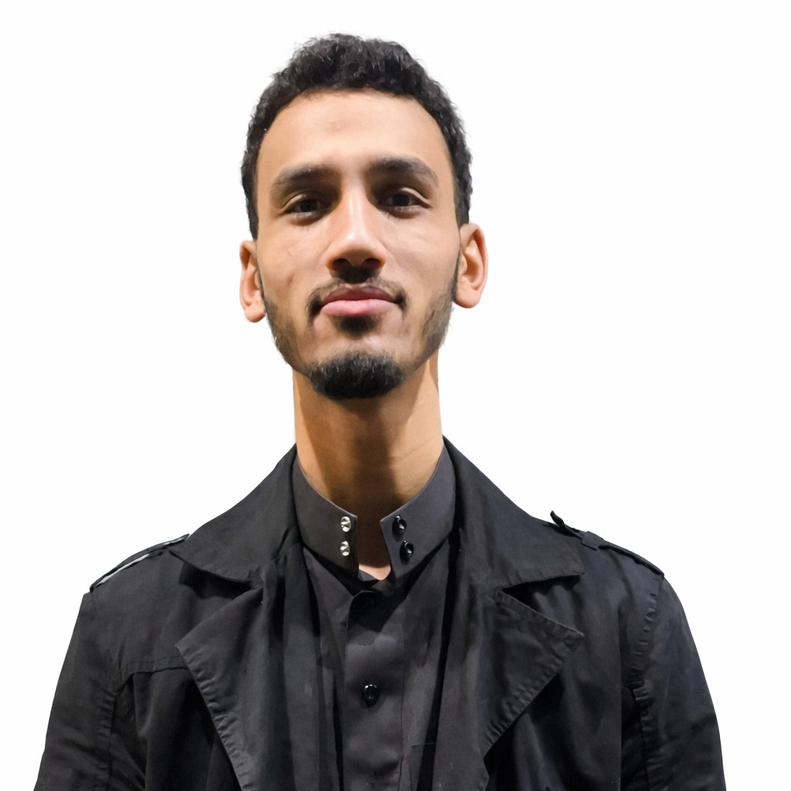

# Mogammad Redah Gamieldien

<h1 align="center">Mogammad Redah Gamieldien</h1>

💻 Application Development Student

📍 Kensington, Cape Town • 📞 072 272 1910 • 📧 222641681@mycput.ac.za • 
<a href="https://www.linkedin.com/in/mogammadredah-gamieldien-06544a264">LinkedIn</a>

---

## Career Objective
I am an Application Development student currently pursuing a **Diploma in Information and Communication Technology (ICT)** at **Cape Peninsula University of Technology**. I am seeking a **Work Integrated Learning (WIL) internship** where I can apply my academic knowledge in a real-world environment.

My goal is to gain practical industry experience, strengthen my software development skills, and contribute meaningfully to a professional development team while continuing to grow as an IT professional.

---

## Skills
💻 Programming Languages

   

🌐 Web Development

   

🗄 Databases

  

⚙ Tools & Version Control

   

---

## Education

### Kensington High School
**National Senior Certificate**  
2017 – 2021

### Cape Peninsula University of Technology
**Higher Certificate in Information and Communication Technology**  
2023

### Cape Peninsula University of Technology
**Diploma in ICT – Applications Development**  
2024 – Present

---
## Projects

💼 Projects
📚 Student Management System (Java Desktop Application)

    

Description

A desktop-based Student Management System developed as part of a collaborative team project. The application was designed to manage and organize student records efficiently through a user-friendly interface.

Key Features & Contributions

👨‍💻 Collaborated within a development team to design and implement the system.

🧱 Applied Object-Oriented Programming (OOP) principles to build modular and maintainable code.

🗄 Integrated an SQL database for reliable data storage and efficient retrieval of student records.

🔎 Implemented search functionality to quickly locate student information.

🖥 Designed interactive graphical user interfaces using Java Swing.

🛡 Implemented input validation and error handling to improve system stability and user experience.

Technologies Used

Java • Java Swing • SQL • Object-Oriented Programming

🔗 **GitHub Repository:**  
[Student Enrolment Project](https://github.com/MRGamieldien/Student-Enrolment-Project.git)

---  

## References 
### Bhadra Ranchod 

Cape Peninsula University of Technology 

📧 ranchodb@cput.ac.za 

📞 Contact: 082 495 9912 

### Richard Maliwatu 

Cape Peninsula University of Technology 

📧 maliwatur@cput.ac.za 

📞 Contact: 071 077 9922

---

## 🎥Mock Interview

<video width="400" height="350" controls>
  <source src="MockInterview of MRG.mp4" type="video/mp4">
</video>

---

## My Reflection: CV

While writing the README file, I have been exposed to the use of Markdown as a format for documenting my CV in an elegant manner. At first unfamiliar with the syntax, it was necessary for me to come up with a readable document which would effectively convey my CV’s details. In doing so, I have become proficient in using Markdown functionalities such as headings, lists, and text formatting. However, to improve the appearance and organization of my project, I have employed the practice of integrating HTML within Markdown by centering the contents and including embedded media in my document. Overall, I have organized the README into sections and added icons and badges to enhance its appearance and usability. By doing so, I have succeeded in creating an elegant document which effectively communicates my CV.

---

## My Reflection: Mock Interview

During my mock interview, I answered four common questions about my career goals, how I handle stress, a conflict with a team member, and my work preference, which allowed me to evaluate my performance through a recorded video. My goal was to communicate clearly, confidently, and professionally while applying the STAR method and keeping my responses concise and natural. To achieve this, I prepared structured answers, practiced delivering them in a conversational tone, and focused on speaking clearly, maintaining good posture, and organizing my thoughts logically during the interview; I also reviewed the recording afterward to identify areas for improvement such as pacing, eye contact, and reducing filler words . As a result, I improved my confidence and ability to structure answers effectively, especially when explaining the conflict scenario, while also recognizing the need to sound less rehearsed and improve my body language, making the experience valuable preparation for real interviews.

---

## My Reflection: 

While working on my CV, I used GitHub Pages to turn my repository into a live website so others could easily view my CV. At first, I wasn’t very familiar with how GitHub Pages works, so I had to figure out how to set everything up correctly and make sure my content displayed properly online. I organized my files, adjusted my Markdown and HTML, and tested the site a few times to fix layout and formatting issues. As I worked through it, I started to understand how everything connects, from the repository to the live site. In the end, I was able to successfully publish a working website that presents my project in a more professional and interactive way. This experience helped me understand how to deploy projects, improved my confidence in using GitHub, and showed me how important it is to present your work clearly, not just build it.
